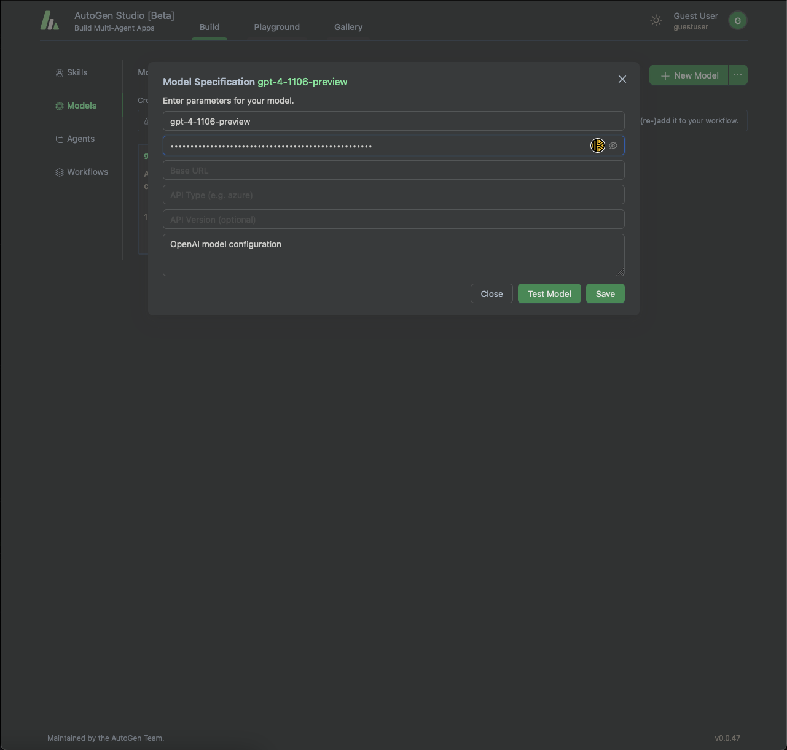

# Autogen Studio in Docker

<div align="left">
   
</div>


## What is AutoGen Studio?

Autogen Studio by Microsoft: A tool designed to redefine efficiency in development projects. By harnessing a collaborative approach, Autogen Studio ensures tasks are completed swiftly and with greater precision than a lone effort could achieve.

Utilizing OpenAI APIs or a local model, Autogen Studio opens up a world of possibilities for automating tasks. Whether it's writing code, analyzing data, generating diagrams, or anything else you can envision, this tool is versatile enough to handle it all.

It's particularly effective for building websites, creating applications and managing large data sets with ease. By taking over routine coding tasks, Autogen Studio not only saves developers time but also allows them to concentrate on the more complex and innovative aspects of their projects.

So my contribution is making sure that your AutoGen Studio runs in Docker with persistent storage. That way your data, threads, and settings are preserved across container restarts or removals. 

If you like this project, please give it a ⭐️

## Prerequisites

1. Docker installed on your system 
2. Docker Compose installed on your system
3. OpenAI API key
4. Inspirational to prompt dreams 🌈✨

## Quick Start

### 1. Clone this repository and run this command to start the AutoGen Studio service:

   ```bash
   docker volume create autogen-studio-data
   ```
   
   ```bash
   docker-compose up --detach --build
   ```

### 2. Access your AutoGen Studio by visiting `http://localhost:8081`, and you will arrive at this page:


### 3. Click on the `Build` button top left, then `Models` on the left. Then click on the model `gpt-4-1106-preview`.

Here you need to enter you OPEN AI API key, you can get it from https://platform.openai.com/account/api-keys

You can also add multiple models here if you like, and use the same API key for all of them.



### 4. Click on the `Agents` button on the left, and select `primary_assistant`.

Here you need remove the `gpt-4-1106-preview` press ok.

Then select the `primary_assistant` again and add the `gpt-4-1106-preview` model again, then press ok.


### 5. Click on the `Playground` button on top, and create new `session`.

And select the `General Agent Workflow`.

You will probably see an error message stating that the OPEN AI API key is not entered correctly

I'm not sure why, but for me, I just need to create a new session again, and then it works

You can also try to go back to the `primary_assistant` and re-select the model again.

This bug will probably be fixed in the future.


### 6. Now you are ready to use the AutoGen Studio. Go prompt your dreams! 


## Starting and Stopping the Service

1. When you're done, you can stop the service using:

   ```
   docker-compose down
   ```

   This command stops and removes the running container, but your data will be preserved in the `autogen-studio-data` volume.

2. To restart the service with your existing data, simply run:
   
      ```
      docker-compose up --detach
      ```
   
      This will start the AutoGen Studio service using the existing data and settings.

## Configuration

After you have started the AutoGen Studio you will be able to create your workers, threads and add your API keys that are needed. And they will be saved due to the persistent storage. As of the time of writing this, there is only support for ollama and OpenAI API.

The Docker Compose file (`docker-compose.yml`) is configured to mount the `autogen-studio-data` volume to the `/usr/local/lib/python3.11/site-packages/autogenstudio` directory within the container. This directory is where AutoGen Studio stores its state, threads, and settings.


## Cleanup

If you want to remove the persistent data and start fresh, you can remove the `autogen-studio-data` volume using the following command:

```
docker volume rm autogen-studio-data
```

```
docker image rm autogen-studio-docker
```

This will permanently delete the volume and the image from your system.

## Notes

Since this setup always installs the latest version of autogen-studio, and autogen there might be some bugs or changes that are not covered in this guide. 

If you like this project, please give it a ⭐️

And if you find any bugs or have any suggestions, please let me know. 🤩


## Credits

Give an round of applause for the great minds that inspired me to create this project:

🌟 [How to Set Up AutoGen Studio with Docker by Finxter](https://blog.finxter.com/how-to-set-up-autogen-studio-with-docker/)

🌟 [autogen-studio-dockerfile by WaywardHayward](https://github.com/WaywardHayward/autogen-studio-dockerfile)

🌟 [autogen Github by Microsoft](https://github.com/microsoft/autogen)